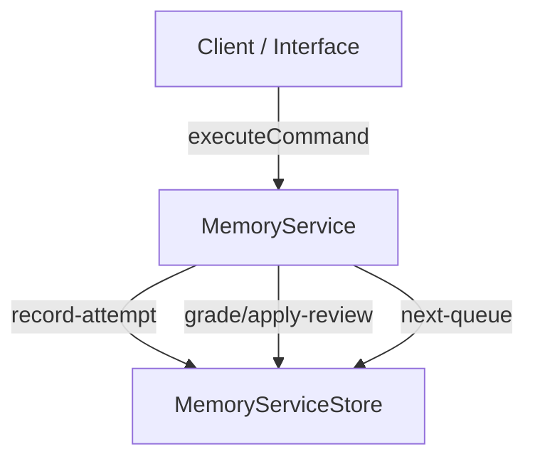

# Service Contract v0 Hardening

This document records the stable, hardened local service contract (`MemoryService`) for Scry's Rust engine after incorporating mobile beta interface pressure. It explicitly outlines what is stable, what remains private, and what evidence would justify future extraction or promotion.

## Command Lifecycle

The service exposes a single unified entry point `execute` supporting a strict command lifecycle.

### 1. `record-attempt`
Records a raw, ungraded attempt from the client (e.g. ungraded text entries, telemetry, or raw response metrics). 
- **Consequences**: Persists the raw attempt in the store for audit trails and telemetry.
- **Scheduling**: Does not advance reps, intervals, or schedule state.

### 2. `grade/apply-review`
Grades a submitted answer against a defined `Prompt` definition using the engine's deterministic grading rules, invokes the FSRS scheduler, and atomically persists both the attempt and the next schedule state.
- **Consequences**: Creates a graded attempt and updates the scheduling record for the review unit.
- **Concurrency**: Guaranteed via compare-and-apply write semantics.

### 3. `next-queue`
Selects the next queue candidate based on due dates, eligibility, and the shared progression queue primitive.
- **Consequences**: Read-only queue projection; does not mutate any state.

---

## Learner-Facing DTO Decision

To keep the service boundary deep (John Ousterhout mindset), the DTO interface is strictly decoupled from presentation details.

- **Stable Scheduling DTOs**: The service contract accepts a pure `Prompt` (representing the question structure and accepted answers) and returns the standard `GradeResult` and `ScheduleState` (the FSRS scheduling properties).
- **Private UI DTOs**: UI-centric fields (such as worked solutions, layout instructions, or formatted study statistics) remain private application-layer concerns. The service boundary has no awareness of how solutions or hints are formatted.

---

## Reveal Policy

`reveal` is explicitly classified as a **display-only UI state** rather than a review event with scheduling consequences.

> [!IMPORTANT]
> The service has no `reveal` command. Showing the answer or worked solution to the learner is a pure presentation transition on the client. It has **zero scheduling impact** and does not invoke store or scheduler writes. Scheduling only advances when the user actively submits or grades their response.

---

## Activity-Kind Metadata Decision

Activity kind (quiz vs exercise), ladder stage, variant group, and specific critique notes are maintained as private beta pressure in the application layer.

- **Current Stance**: These fields remain outside the scheduling core to prevent speculative, provider-neutral schema pollution.
- **Justification for Extraction**: We will keep these metadata properties private until a graduated provider-neutral ladder is implemented, proving standard semantics across multiple clients.

---

## Retry, Idempotency, and Compare-and-Apply

Durable store backends must provide high reliability under concurrent requests or network retries.

### Idempotency Strategy
Clients can supply an optional `idempotencyKey` inside command DTOs.
- **Behavior**: The store is responsible for indexing and verifying `idempotencyKey`. The current implementation rejects duplicate completed operations with `DuplicateAppliedReviewError`, preventing duplicate reps or attempts from being counted.

### Compare-and-Apply (Optimistic Concurrency)
To prevent race conditions where multiple clients submit answers concurrently for the same review unit, `grade/apply-review` uses atomic compare-and-apply updates:
1. The service reads the schedule state from the store.
2. The scheduler computes the next state.
3. The store is invoked with both the calculated next state and the `expectedPriorScheduleState`.
4. If the persisted schedule state in the store has changed in the interim, the write fails, throwing a `StaleScheduleWriteError`.

---

## Typed Failure Envelope

The service boundary provides a hardened input validation layer. Well-defined boundary validations reject:
- Blank or empty submitted answers.
- Non-integer or non-positive response times.
- Malformed epoch timestamps.
- Unknown/unregistered review units.

### Hardened Error Classes

| Exception Class | Trigger Condition |
| :--- | :--- |
| `DuplicateAppliedReviewError` | Triggered when a duplicate attempt with the same idempotency key is submitted. |
| `StaleScheduleWriteError` | Triggered when a compare-and-apply write fails due to a concurrent write or mismatched prior state. |
