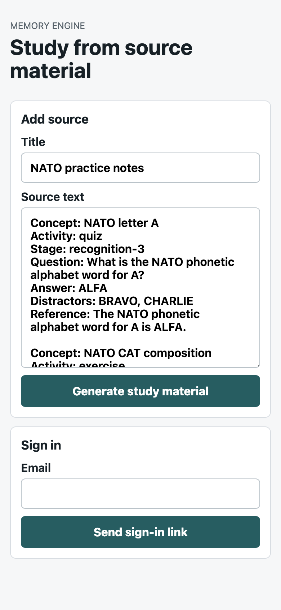
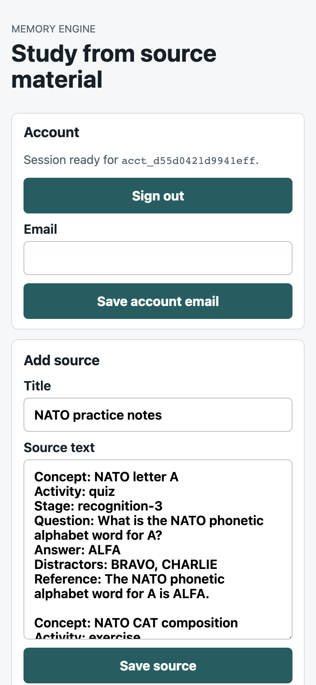
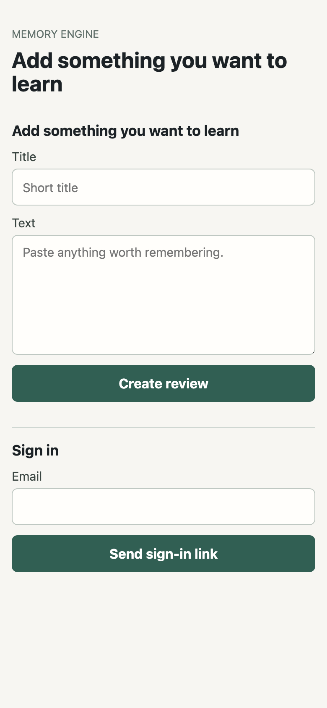
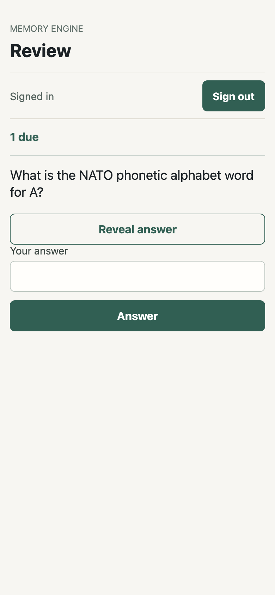

# 048 Hypersimple Study Interface Design Receipt

Local receipt captured on a 390 x 844 phone viewport before merge. The before
app ran from `master` at `http://127.0.0.1:18081`; the after app ran from
`cx/048-hypersimple-study-interface` at `http://127.0.0.1:18082`. Both review
screens used the real browser magic-link flow after seeding an allowlisted
account through the JSON API.

## Before

Observed blockers:

- First contact opened on a NATO-filled source form instead of an empty learning capture.
- The review entry viewport was consumed by account machinery, account ULID, email save form, and raw source text before the learner could review.
- Raw structured-source vocabulary such as stages, activities, distractors, and references was visible in the learning surface.

## After

Acceptance notes:

- First contact opens to an empty capture form with one plain placeholder hint.
- Signed-in review opens to one due count, one prompt, one answer input, and reveal/answer controls.
- The review viewport omits source lists, generated-card lists, account ids, email re-entry, pipeline counts, validation details, and raw activity stages.
- Source archive remains available from the management surface, outside the review viewport.

Live deployed critique and Lighthouse receipts should be appended after PR merge
and deploy.
